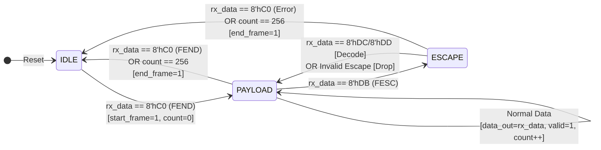

# KISS Telemetry Protocol RTL Decoder

## Overview
A fully synchronous RTL hardware implementation of a **KISS (Keep It Simple Stupid)** protocol decoder written in Verilog. The KISS protocol is a byte-oriented framing protocol widely used in telemetry, telecommand, and serial communications.

This module is designed to receive an incoming stream of framed bytes, dynamically strip away the transport framing, resolve escaped characters, and output a clean, raw payload.

## Core Features
* **Single-Clock Synchronous FSM:** Clean state machine design ensuring all control signals (`data_valid`, `start_frame`, `end_frame`) are precise 1-cycle pulses.
* **Dynamic Escape Resolution:** Accurately decodes standard KISS escape sequences (`FESC TFESC` to `FESC` and `FESC TFEND` to `FEND`) on the fly.
* **Strict Payload Enforcement:** Enforces a rigid 256-byte maximum payload constraint, cleanly terminating frames that exceed the boundary.
* **Fault Tolerance:** Built-in error handling for unexpected frame drops (e.g., receiving an unexpected `FEND` during an active escape sequence).

## Protocol Specification
* `FEND` (Frame End): `0xC0`
* `FESC` (Frame Escape): `0xDB`
* `TFEND` (Transposed Frame End): `0xDC`
* `TFESC` (Transposed Frame Escape): `0xDD`

## Simulation & Verification
The design was functionally verified using a custom Verilog testbench. The verification suite covers:
1. Standard data payloads.
2. Complex payloads containing sequential escaped characters.
3. Sudden line-drops and corrupted frames.
4. 256-byte boundary condition testing.

## Ports Description

| Port Name     | Direction | Width  | Description |
| :---          | :---      | :---   | :--- |
| `clk`         | Input     | 1-bit  | System clock |
| `reset`       | Input     | 1-bit  | Active-high synchronous reset |
| `rx_data`     | Input     | 8-bit  | Incoming KISS-framed byte stream |
| `rx_valid`    | Input     | 1-bit  | High when `rx_data` is valid |
| `data_out`    | Output    | 8-bit  | Decoded raw payload byte |
| `data_valid`  | Output    | 1-bit  | 1-cycle pulse when `data_out` is valid |
| `start_frame` | Output    | 1-bit  | 1-cycle pulse indicating frame start |
| `end_frame`   | Output    | 1-bit  | 1-cycle pulse indicating frame end |
